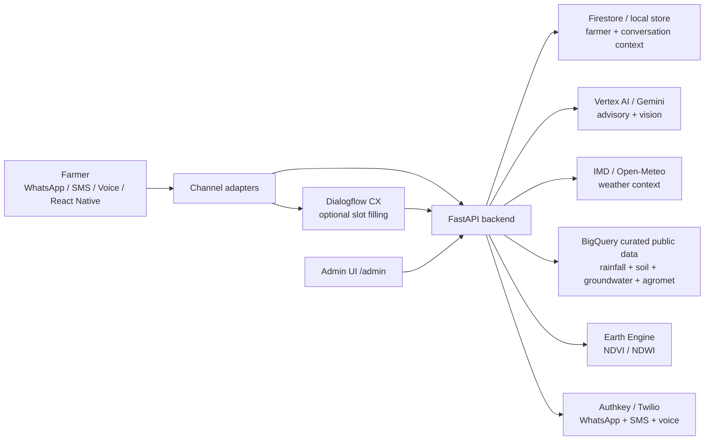

# Kisan Alert Hackathon Prototype

Track 4: Smart Water, Crop and Advisory System.

This is a standalone FastAPI prototype for the competition track. It intentionally contains only the pieces required for the Kisan Alert problem statement and avoids product-specific or proprietary application code from any existing system. It shows one complete end-to-end flow:

1. Identify a farmer across WhatsApp, SMS, call or app by phone and progressively capture farm context.
2. Recommend crops using soil, rainfall, groundwater, NDVI and water availability.
3. Generate dry-spell irrigation/fertilizer alerts from weather and sensor readings.
4. Log crop health through text, voice transcript or photo metadata.
5. Create a Rythu Seva Kendra follow-up ticket.
6. Support WhatsApp Business, voice-call and SMS style intake for low-connectivity farmers.

The code is organized so Google Cloud, government data, and communication providers stay behind service adapters. Local tests avoid live network calls, while runtime integrations should use configured real providers.

## Stack

- Python 3.11+
- FastAPI
- Pydantic
- Uvicorn
- Optional Google Cloud adapters:
  - Gemini API or Vertex AI for advisory and crop photo diagnosis
  - Earth Engine for NDVI and satellite signals
  - Cloud Speech-to-Text and Text-to-Speech for voice
  - Translation API for Indic language localization
  - Cloud Run for deployment
  - BigQuery for public datasets and analytics
- WhatsApp Business API, SMS gateway, or voice-call IVR provider for farmer channels

## Project Structure

```text
app/
  api/v1/endpoints/      HTTP endpoints by feature
  core/                  settings and app configuration
  models/                request/response schemas and crop domain data
  repositories/          Firestore-backed runtime store plus isolated local test store
  services/              business logic and external integration adapters
  utils/                 language helpers
react_native_chat_app/    Expo React Native farmer chat prototype
scripts/                  Utility scripts such as BigQuery CSV ingestion
tests/                   FastAPI flow tests
```

## Architecture Visualization



## Run Backend Locally

```bash
cd kisan-alert-hackathon
python3 -m venv .venv
source .venv/bin/activate
pip install -e ".[dev]"
DATA_STORE_PROVIDER=local ENABLE_GOOGLE_INTEGRATIONS=false uvicorn app.main:app --reload --port 8080
```

If you are using the existing Google-enabled virtual environment:

```bash
DATA_STORE_PROVIDER=local ENABLE_GOOGLE_INTEGRATIONS=false .venv-google/bin/uvicorn app.main:app --host 127.0.0.1 --port 8080
```

Open:

- API docs: http://127.0.0.1:8080/docs
- Admin service switch UI: http://127.0.0.1:8080/admin
- Health: http://127.0.0.1:8080/health

## Run React Native Chat App

Install Node.js dependencies, start the backend, then run the Expo app:

```bash
cd react_native_chat_app
npm install
npm run android
```

The default Android emulator API URL is `http://10.0.2.2:8080`.

For web testing:

```bash
EXPO_PUBLIC_API_URL=http://127.0.0.1:8080 npm run web
```

For a physical Android device, use your machine LAN IP:

```bash
EXPO_PUBLIC_API_URL=http://192.168.1.20:8080 npm start
```

The React Native app supports phone/language onboarding, WhatsApp-like chat, text messages, current location sharing, crop photo capture/selection and voice-note transcript payloads through `/api/v1/whatsapp/webhook`.

## API Functionality

| API | Functionality |
|---|---|
| `GET /health` | Boolean health status for database, AI, weather, speech, translation and channel services. |
| `GET /admin` | Browser admin UI for service health and provider route switching. |
| `GET/PATCH /api/v1/providers/config` | Read/update primary/fallback providers for weather, STT, TTS, translation, LLM, vision, satellite, maps, WhatsApp and SMS/voice. |
| `POST /api/v1/farmers` | Create a farmer with complete profile. |
| `POST /api/v1/farmers/identify` | Identify or progressively create farmer from phone/channel/location. |
| `POST /api/v1/recommendations/crop` | Recommend crops using farmer profile, rainfall, soil, groundwater and optional NDVI. |
| `POST /api/v1/satellite/farm-signal` | Fetch Earth Engine NDVI, NDWI, NDMI, EVI, NDRE, vegetation status and water-stress signal for farmer coordinates or farm polygon. |
| `POST /api/v1/weather/context` | Fetch weather context through configured weather provider route. |
| `POST /api/v1/advisories/dry-spell` | Generate dry-spell irrigation/fertilizer advisory. |
| `POST /api/v1/advisories/crop-stage` | Generate crop-stage advisory for sowing through harvest. |
| `POST /api/v1/alerts/run-daily` | Run proactive daily alert generation and delivery for selected/all farmers. |
| `POST /api/v1/alerts/run-daily/pubsub` | Cloud Scheduler/Pub/Sub-compatible daily alert worker trigger. |
| `POST /api/v1/alerts/deliver` | Deliver an alert plan through WhatsApp, SMS and/or voice call. |
| `POST /api/v1/diagnosis/log` | Log crop symptoms/photo metadata and create expert ticket. |
| `POST /api/v1/soil-cards/extract` | Extract soil card values with vision provider pipeline and persist to farmer profile when `farmer_id` is supplied. |
| `POST /api/v1/voice/transcribe` | Convert voice audio payload to text. |
| `POST /api/v1/voice/speak` | Convert text reply to voice audio. |
| `POST /api/v1/translate/text` | Translate text through configured translation route. |
| `POST /api/v1/sms/webhook` | SMS-style farmer intake. |
| `POST /api/v1/whatsapp/webhook` | WhatsApp-style text/location/media/voice intake. |
| `POST /api/v1/calls/webhook` | Voice-call/IVR style intake. |
| `POST /api/v1/{whatsapp,sms,calls}/receipt` | Store provider delivery receipt/status callback with normalized retry state. |
| `POST /api/v1/dialogflow/webhook` | Dialogflow CX fulfillment webhook for structured multi-turn flows. |
| `GET /api/v1/data/sources` | List useful government/public data sources. |
| `POST /api/v1/data/context` | Query BigQuery public-data context for rainfall, groundwater, soil, crop history and agromet. |
| `POST /api/v1/conversations/log` | Store a farmer/assistant/expert conversation turn. |
| `GET /api/v1/conversations/{farmer_id}` | Read recent conversation context. |
| `GET /api/v1/expert/tickets/{farmer_id}` | List expert follow-up tickets. |
| `GET/PATCH /api/v1/expert/ticket/{ticket_id}` | Read/update expert ticket status, assignment, notes and farmer notification. |

## Demo API Flow

Create a farmer when full profile data is available:

```bash
curl -X POST http://127.0.0.1:8080/api/v1/farmers \
  -H "Content-Type: application/json" \
  -d '{
    "name": "Ravi",
    "phone": "9999999999",
    "language": "te-IN",
    "village": "Demo Village",
    "district": "Guntur",
    "state": "Andhra Pradesh",
    "farm": {
      "area_acres": 2.5,
      "soil_type": "black",
      "soil_ph": 6.8,
      "groundwater_depth_m": 18,
      "latitude": 16.3,
      "longitude": 80.4
    }
  }'
```

If `rainfall_forecast_mm` is omitted and the farmer profile has farm coordinates, the backend fetches weather context through the configured provider route: IMD primary when configured, Open-Meteo fallback otherwise.

Fetch weather context directly:

```bash
curl -X POST http://127.0.0.1:8080/api/v1/weather/context \
  -H "Content-Type: application/json" \
  -d '{
    "latitude": 18.5204,
    "longitude": 73.8567,
    "days": 7
  }'
```

Get crop recommendations:

```bash
curl -X POST http://127.0.0.1:8080/api/v1/recommendations/crop \
  -H "Content-Type: application/json" \
  -d '{
    "farmer_id": "replace-with-created-id",
    "season": "kharif",
    "expected_rainfall_mm": 620,
    "ndvi": 0.42,
    "water_availability": "medium"
  }'
```

Generate a dry-spell advisory:

```bash
curl -X POST http://127.0.0.1:8080/api/v1/advisories/dry-spell \
  -H "Content-Type: application/json" \
  -d '{
    "farmer_id": "replace-with-created-id",
    "crop": "maize",
    "soil_moisture": 0.18,
    "rainfall_forecast_mm": [0, 0, 0, 1, 0, 0, 3],
    "temperature_c": 36
  }'
```

Log crop health and create expert follow-up:

```bash
curl -X POST http://127.0.0.1:8080/api/v1/diagnosis/log \
  -H "Content-Type: application/json" \
  -d '{
    "farmer_id": "replace-with-created-id",
    "crop": "chilli",
    "symptoms_text": "Leaves curling and white insects visible",
    "photo_uri": "gs://kisanai-501120-kisan-ai-media/crop-images/chilli-leaf.jpg"
  }'
```

Simulate a WhatsApp message:

```bash
curl -X POST http://127.0.0.1:8080/api/v1/whatsapp/webhook \
  -H "Content-Type: application/json" \
  -d '{
    "from_phone": "9999999999",
    "text": "my chilli leaves are curling",
    "language": "hi-IN"
  }'
```

Progressively identify a farmer from any channel:

```bash
curl -X POST http://127.0.0.1:8080/api/v1/farmers/identify \
  -H "Content-Type: application/json" \
  -d '{
    "phone": "+91 9999999999",
    "channel": "whatsapp",
    "language": "hi-IN",
    "pincode": "522001"
  }'
```

Simulate a voice-call IVR callback:

```bash
curl -X POST http://127.0.0.1:8080/api/v1/calls/webhook \
  -H "Content-Type: application/json" \
  -d '{
    "from_phone": "9999999999",
    "call_id": "demo-call-1",
    "dtmf_digit": "1",
    "language": "te-IN"
  }'
```

## Google Cloud Integration Plan

Use the existing service classes as stable boundaries:

- `GeminiService`: switch `diagnose_crop_health` and language response generation to Gemini or Vertex AI.
- `EarthEngineService`: fetch Sentinel/Landsat farm signals through Earth Engine.
- `VoiceService`: use Cloud Speech-to-Text/Text-to-Speech and store durable transcript/advisory text.
- `SmsService`: plug Twilio, Gupshup, or a basic SMS gateway webhook.
- `WhatsAppService`: plug WhatsApp Business Cloud API webhook verification, templates and media fetch.
- `CallService`: plug Exotel, Twilio Voice, Knowlarity or another IVR/call provider callback.
- `WeatherService`: use configured weather provider route; IMD is primary when configured and Open-Meteo is the real free fallback.
- `GovernmentDataService`: queries BigQuery curated public-data tables for rainfall, groundwater, soil health, crop history and agromet context.
- `CropStageAdvisoryService`: add crop-stage rules and Gemini synthesis for sowing through harvest.
- `SoilCardVisionService`: replace text-parser fallback with Gemini/Vertex AI Vision soil-card extraction.
- `ConversationStore`: persist farmer conversation context in Firestore and export anonymized analytics to BigQuery.
- `AlertPriorityPolicy`: central policy for WhatsApp/SMS/voice-call escalation.

For the competition, this structure keeps each feature independently owned while the backend moves from verified service connectivity to production-style integrations.

## Provider Onboarding Docs

- [Google setup verification](docs/setup/GOOGLE_SETUP_VERIFICATION.md)
- [Google smoke test results](docs/setup/GOOGLE_SMOKE_TEST_RESULTS.md)
- [Service fallback plan](docs/setup/SERVICE_FALLBACKS.md)
- [Backend development sequence](docs/DEVELOPMENT_SEQUENCE.md)
- [Public data ingestion plan](docs/data/PUBLIC_DATA_INGESTION.md)
- [Cloud Run deployment guide](docs/deployment/CLOUD_RUN_DEPLOYMENT.md)
- [Channel provider roadmap](docs/providers/README.md)
- [Authkey SMS and WhatsApp](docs/providers/AUTHKEY_SMS_AND_WHATSAPP.md)
- [WhatsApp Business Cloud API](docs/providers/WHATSAPP_BUSINESS_CLOUD_API.md)
- [Google Dialogflow](docs/providers/GOOGLE_DIALOGFLOW.md)

## IP Boundary

This repository is a clean hackathon scaffold. It does not import or copy private business logic, database schemas, app screens, assets, translations, or release code from existing products. The overlap is limited to the public competition domain: crop recommendation, dry-spell advisory, crop health logging, expert follow-up and low-connectivity farmer channels.

The frontend can be added later as a WhatsApp-like chat UI, but the backend does not assume any specific frontend framework.
