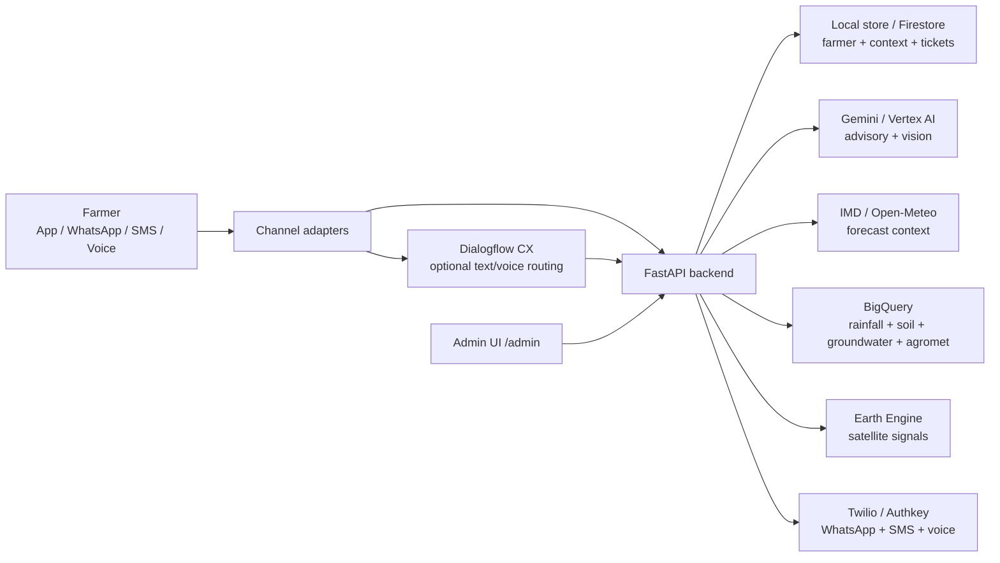

# Kisan Alert

Track 4: Smart Water, Crop and Advisory System.

Kisan Alert is a FastAPI + React Native hackathon prototype for small and marginal farmers. It demonstrates a multilingual advisory platform that works through a mobile chat app, WhatsApp, SMS and voice calls. The backend is designed around real providers and clean adapters, so Google Cloud, government datasets and communication channels can be switched without changing farmer-facing flows.

## What The Demo Shows

1. Farmer starts from the React Native app, WhatsApp, SMS or voice call.
2. Farmer is identified by phone number across channels.
3. Missing profile context is captured progressively instead of forcing a long onboarding form.
4. Farmer can ask in an Indic language by text or voice.
5. Farmer can share farm location.
6. Farmer can send crop photo for diagnosis and expert follow-up.
7. Backend stores farmer, farm context, conversation turns and expert tickets.
8. Advisory/recommendation services use weather, soil, rainfall, groundwater, satellite and crop-stage context where available.
9. Admin can view service health and switch configured provider routes.

## Features

- Multilingual farmer chat in React Native with WhatsApp-style UI.
- Text, image, location and voice-note intake.
- Automatic language detection when Google integrations are enabled, with explicit language selection as fallback.
- Smart crop recommendation using soil, rainfall, groundwater, NDVI and water availability.
- Dry-spell irrigation and fertilizer advisory.
- Crop-stage advisory for sowing, germination, vegetative growth, flowering and harvest.
- Crop health logging from text, voice transcript or crop photo.
- Soil-card extraction interface through vision/OCR providers.
- Rythu Seva Kendra-style expert ticket creation and follow-up.
- Daily alert worker with Scheduler/Pub/Sub-compatible endpoint.
- Provider route switching for Google/government primary and fallback services.
- Channel adapters for React Native app, WhatsApp, SMS, voice calls, Dialogflow CX, Authkey and Twilio.

## Technology Stack

- Backend: Python 3.12, FastAPI, Pydantic, Uvicorn, pytest.
- Mobile/web frontend: Expo React Native, Expo Router, Expo Location, Expo Image Picker, Expo Audio.
- AI: Gemini API and Vertex AI provider adapters.
- Voice: Google Speech-to-Text/Text-to-Speech and Sarvam fallback adapters.
- Translation: Google Translate and Sarvam fallback adapters.
- Vision/OCR: Gemini Vision and Vertex AI Vision adapters.
- Satellite: Google Earth Engine adapter for NDVI, NDWI, NDMI, EVI and NDRE.
- Data: Firestore for runtime store, BigQuery for curated public datasets.
- Weather: IMD planned primary, Open-Meteo fallback.
- Maps/geocoding: Google Maps, OSM fallback.
- Channels: Twilio, Authkey, WhatsApp Business style webhooks, SMS and voice-call IVR.
- Deployment: Docker, Cloud Run, Cloud Scheduler, Pub/Sub and Secret Manager.

## Channel Matrix

| Channel | Endpoint | What Works | Dialogflow Use | Notes |
|---|---|---|---|---|
| React Native app | `POST /api/v1/chat/message` | Text, image, location, audio note, audio reply playback | Text can route through Dialogflow when enabled; media/location handled by backend | Android/web frontend uses this endpoint, not WhatsApp webhook. |
| Authkey/generic WhatsApp | `POST /api/v1/whatsapp/webhook` | Text, location, image/media URL/base64, voice/audio URL/base64 | Text only, when enabled | Provider-style JSON webhook. Sends outbound WhatsApp template only when configured. |
| Twilio WhatsApp | `POST /api/v1/twilio/whatsapp` | Text, location via `Latitude`/`Longitude`, image/media via `MediaUrl0` | Text only, when enabled | Returns TwiML `<Message>`. Location/media are normalized before backend handling. |
| Authkey/generic SMS | `POST /api/v1/sms/webhook` | Text SMS intent intake | Text only, when enabled | JSON webhook. |
| Twilio SMS | `POST /api/v1/twilio/sms` | Text SMS intent intake | Text only, when enabled | Returns TwiML `<Message>`. |
| Authkey/generic voice callback | `POST /api/v1/calls/webhook` | Transcript or DTMF callback | Transcript text, when enabled | JSON callback. |
| Twilio voice call | `POST /api/v1/twilio/voice` | SpeechResult and DTMF through `<Gather>` | Speech transcript text, when enabled | Returns TwiML with `<Gather input="speech dtmf">`. |
| Dialogflow CX fulfillment | `POST /api/v1/dialogflow/webhook` | Structured fulfillment for irrigation, crop recommendation, diagnosis, location, expert follow-up | Native | Used by Dialogflow agent pages/intents after Cloud Run deployment. |

Dialogflow is useful for text and voice intent routing. It should not be the raw processor for WhatsApp images or location payloads. Twilio sends location as `Latitude` and `Longitude`, and images as media URLs, so the backend normalizes those first and then calls the right service.

## Project Structure

```text
app/
  api/v1/endpoints/       FastAPI endpoints by feature/channel
  core/                   settings and configuration
  models/                 request/response schemas and domain models
  repositories/           local and Firestore-backed stores
  services/               business logic and provider adapters
  utils/                  language helpers
react_native_chat_app/    Expo React Native farmer chat app
scripts/                  deployment and utility scripts
smoke_tests/              real-provider smoke tests
tests/                    offline automated tests
docs/                     setup, provider and deployment guides
```

## Architecture



## Required Keys And Services

The app can run locally without live Google/provider keys by using local mode:

```bash
DATA_STORE_PROVIDER=local
ENABLE_GOOGLE_INTEGRATIONS=false
```

For full live provider testing, prepare these values in `.env` or Secret Manager:

| Variable | Required For |
|---|---|
| `GOOGLE_CLOUD_PROJECT` | Firestore, BigQuery, Vertex AI, Earth Engine, Dialogflow, Cloud Run. |
| `GOOGLE_CLOUD_LOCATION` | Vertex AI and Dialogflow region, for example `asia-south1`. |
| `GEMINI_API_KEY` | Gemini API fallback. |
| `GEMINI_MODEL` | Gemini model, for example `gemini-2.5-flash`. |
| `VERTEX_AI_MODEL` | Vertex model, for example `gemini-2.5-flash`. |
| `SARVAM_API_KEY` | Sarvam STT/TTS/translation fallback. |
| `AUTHKEY_API_KEY` | Authkey SMS/voice/WhatsApp tests. |
| `AUTHKEY_WHATSAPP_TEMPLATE_ID` | Authkey outbound WhatsApp template sending. |
| `MAPS_API_KEY` | Google Maps/geocoding provider. |
| `STORAGE_BUCKET` | Crop images, soil-card images and optional media storage. |
| `BIGQUERY_PUBLIC_DATASET` | Curated government/public data tables. |
| `DIALOGFLOW_ROUTING_ENABLED` | Enables Dialogflow text routing when `true`. |
| `DIALOGFLOW_AGENT_ID` | Dialogflow CX agent ID. |
| `DIALOGFLOW_LOCATION` | Dialogflow region. |
| `FIRESTORE_DATABASE` | Firestore database, usually `(default)`. |

Google local auth for real service smoke tests:

```bash
gcloud auth login
gcloud auth application-default login
gcloud config set project kisanai-501120
```

## Install Backend

From the repository root:

```bash
cd kisan-alert-hackathon
python3 -m venv .venv
source .venv/bin/activate
pip install -r requirements.txt
pip install -e ".[dev]"
```

If you already use the checked local Google-enabled virtual environment, use `.venv-google/bin/python` and `.venv-google/bin/uvicorn` in the commands below.

## Run Backend Locally

Offline/local mode:

```bash
DATA_STORE_PROVIDER=local ENABLE_GOOGLE_INTEGRATIONS=false uvicorn app.main:app --host 127.0.0.1 --port 8080
```

Using the existing `.venv-google` environment:

```bash
DATA_STORE_PROVIDER=local ENABLE_GOOGLE_INTEGRATIONS=false .venv-google/bin/uvicorn app.main:app --host 127.0.0.1 --port 8080
```

Open:

- API docs: http://127.0.0.1:8080/docs
- Admin UI: http://127.0.0.1:8080/admin
- Health: http://127.0.0.1:8080/health

## Install And Run React Native App

Start the backend first. Then:

```bash
cd react_native_chat_app
npm install
npm run typecheck
```

Android emulator:

```bash
npm run android
```

The emulator uses `http://10.0.2.2:8080` by default.

Web preview:

```bash
EXPO_PUBLIC_API_URL=http://127.0.0.1:8080 npm run web -- --port 8081
```

Static web export check:

```bash
EXPO_PUBLIC_API_URL=http://127.0.0.1:8080 npm run export:web
```

Physical Android device:

```bash
EXPO_PUBLIC_API_URL=http://YOUR_MACHINE_LAN_IP:8080 npm start
```

The React Native app sends farmer messages to `/api/v1/chat/message`.

## Run Automated Tests

Backend unit/flow tests:

```bash
DATA_STORE_PROVIDER=local ENABLE_GOOGLE_INTEGRATIONS=false .venv-google/bin/python -m pytest tests
```

Python compile check:

```bash
.venv-google/bin/python -m compileall app scripts smoke_tests tests
```

Frontend typecheck:

```bash
cd react_native_chat_app
npm run typecheck
```

Frontend build/export check:

```bash
EXPO_PUBLIC_API_URL=http://127.0.0.1:8080 npm run export:web
```

Expected current result:

```text
45 passed, 1 warning
```

The warning is from Starlette/FastAPI TestClient dependency compatibility and does not fail tests.

## Run Real Provider Smoke Tests

Smoke tests live in `smoke_tests/`. They require `.env` values and Google ADC or provider keys.

Examples:

```bash
.venv-google/bin/python smoke_tests/test_gemini.py
.venv-google/bin/python smoke_tests/test_firestore.py
.venv-google/bin/python smoke_tests/test_storage.py
.venv-google/bin/python smoke_tests/test_bigquery.py
.venv-google/bin/python smoke_tests/test_pubsub.py
.venv-google/bin/python smoke_tests/test_translation.py
.venv-google/bin/python smoke_tests/test_tts.py
.venv-google/bin/python smoke_tests/test_stt.py
.venv-google/bin/python smoke_tests/test_dialogflow.py
.venv-google/bin/python smoke_tests/test_maps_geocoding.py
```

If these fail with `DefaultCredentialsError`, run:

```bash
gcloud auth application-default login
```

## Quick Manual API Flow

App chat text:

```bash
curl -X POST http://127.0.0.1:8080/api/v1/chat/message \
  -H "Content-Type: application/json" \
  -d '{"from_phone":"+91 9970983794","text":"माझ्या शेताला आज पाणी द्यावे का?","language":"mr-IN"}'
```

App farm location:

```bash
curl -X POST http://127.0.0.1:8080/api/v1/chat/message \
  -H "Content-Type: application/json" \
  -d '{"from_phone":"+91 9970983794","latitude":19.0948,"longitude":74.7480,"location_label":"Ahilyanagar farm","language":"mr-IN"}'
```

Twilio WhatsApp location simulation:

```bash
curl -X POST http://127.0.0.1:8080/api/v1/twilio/whatsapp \
  -H "Content-Type: application/x-www-form-urlencoded" \
  --data-urlencode "From=whatsapp:+919970983794" \
  --data-urlencode "MessageSid=SM123" \
  --data-urlencode "Latitude=19.0948" \
  --data-urlencode "Longitude=74.7480" \
  --data-urlencode "Label=Ahilyanagar farm" \
  --data-urlencode "Language=mr-IN"
```

Twilio voice simulation:

```bash
curl -X POST http://127.0.0.1:8080/api/v1/twilio/voice \
  -H "Content-Type: application/x-www-form-urlencoded" \
  --data-urlencode "From=+919970983794" \
  --data-urlencode "CallSid=CA123" \
  --data-urlencode "SpeechResult=Should I irrigate today" \
  --data-urlencode "Language=en-IN"
```

Read conversation history:

```bash
curl http://127.0.0.1:8080/api/v1/conversations/replace-with-farmer-id
```

## Main API Endpoints

| Endpoint | Purpose |
|---|---|
| `GET /health` | Service health booleans. |
| `GET /admin` | Admin UI for provider health and route switching. |
| `GET/PATCH /api/v1/providers/config` | Provider primary/fallback route config. |
| `POST /api/v1/chat/message` | React Native app text/image/audio/location chat. |
| `POST /api/v1/farmers` | Create farmer with full profile. |
| `POST /api/v1/farmers/identify` | Identify/progressively create farmer by phone/channel. |
| `POST /api/v1/recommendations/crop` | Crop recommendation. |
| `POST /api/v1/weather/context` | Weather provider context. |
| `POST /api/v1/satellite/farm-signal` | Earth Engine satellite signals. |
| `POST /api/v1/advisories/dry-spell` | Dry-spell advisory. |
| `POST /api/v1/advisories/crop-stage` | Crop-stage advisory. |
| `POST /api/v1/diagnosis/log` | Crop health log and expert ticket. |
| `POST /api/v1/soil-cards/extract` | Soil card vision extraction. |
| `POST /api/v1/alerts/run-daily` | Daily alert runner. |
| `POST /api/v1/alerts/run-daily/pubsub` | Scheduler/Pub/Sub worker trigger. |
| `POST /api/v1/alerts/deliver` | Send alert over WhatsApp/SMS/voice. |
| `POST /api/v1/voice/transcribe` | Audio to text. |
| `POST /api/v1/voice/speak` | Text to audio. |
| `POST /api/v1/translate/text` | Translate text. |
| `POST /api/v1/dialogflow/webhook` | Dialogflow CX fulfillment. |
| `POST /api/v1/whatsapp/webhook` | Authkey/generic WhatsApp JSON webhook. |
| `POST /api/v1/sms/webhook` | Authkey/generic SMS JSON webhook. |
| `POST /api/v1/calls/webhook` | Authkey/generic voice-call JSON webhook. |
| `POST /api/v1/twilio/whatsapp` | Twilio WhatsApp webhook returning TwiML. |
| `POST /api/v1/twilio/sms` | Twilio SMS webhook returning TwiML. |
| `POST /api/v1/twilio/voice` | Twilio voice webhook returning TwiML. |
| `GET /api/v1/data/sources` | Useful public/government data sources. |
| `POST /api/v1/data/context` | BigQuery public-data context. |
| `GET /api/v1/expert/tickets/{farmer_id}` | Expert tickets by farmer. |

## Deploy To Cloud Run

See [Cloud Run deployment guide](docs/deployment/CLOUD_RUN_DEPLOYMENT.md).

Short version:

```bash
PROJECT_ID=kisanai-501120 \
REGION=asia-south1 \
SERVICE_NAME=kisan-alert-api \
GEMINI_API_KEY_SECRET=GEMINI_API_KEY \
SARVAM_API_KEY_SECRET=SARVAM_API_KEY \
AUTHKEY_API_KEY_SECRET=AUTHKEY_API_KEY \
MAPS_API_KEY_SECRET=MAPS_API_KEY \
scripts/deploy_cloud_run.sh
```

After deploy:

```bash
PROJECT_ID=kisanai-501120 REGION=asia-south1 SERVICE_NAME=kisan-alert-api scripts/print_webhook_urls.sh
PROJECT_ID=kisanai-501120 REGION=asia-south1 SERVICE_NAME=kisan-alert-api scripts/setup_scheduler_pubsub.sh
```

Configure these provider URLs:

- Dialogflow fulfillment: `/api/v1/dialogflow/webhook`
- Twilio WhatsApp: `/api/v1/twilio/whatsapp`
- Twilio SMS: `/api/v1/twilio/sms`
- Twilio voice: `/api/v1/twilio/voice`
- Authkey WhatsApp fallback: `/api/v1/whatsapp/webhook`
- Authkey SMS fallback: `/api/v1/sms/webhook`
- Authkey voice fallback: `/api/v1/calls/webhook`

## Useful Docs

- [Cloud Run deployment guide](docs/deployment/CLOUD_RUN_DEPLOYMENT.md)
- [Google setup verification](docs/setup/GOOGLE_SETUP_VERIFICATION.md)
- [Google smoke test results](docs/setup/GOOGLE_SMOKE_TEST_RESULTS.md)
- [Service fallback plan](docs/setup/SERVICE_FALLBACKS.md)
- [Backend development sequence](docs/DEVELOPMENT_SEQUENCE.md)
- [Public data ingestion plan](docs/data/PUBLIC_DATA_INGESTION.md)
- [Channel provider roadmap](docs/providers/README.md)
- [Authkey SMS and WhatsApp](docs/providers/AUTHKEY_SMS_AND_WHATSAPP.md)
- [WhatsApp Business Cloud API](docs/providers/WHATSAPP_BUSINESS_CLOUD_API.md)
- [Google Dialogflow](docs/providers/GOOGLE_DIALOGFLOW.md)

## Current Known Gaps

- Real BigQuery government datasets still need to be loaded for full recommendation quality.
- Real Earth Engine access must be approved/configured before satellite signals work live.
- Dialogflow CX agent pages/intents must be connected after Cloud Run deployment.
- Android native device/emulator should be smoke-tested before demo submission.
- Live outbound WhatsApp templates depend on provider approval.

## IP Boundary

This repository is a clean hackathon scaffold. It does not import or copy private business logic, database schemas, app screens, assets, translations or release code from existing products. The overlap is limited to the public competition domain: crop recommendation, dry-spell advisory, crop health logging, expert follow-up and low-connectivity farmer channels.
