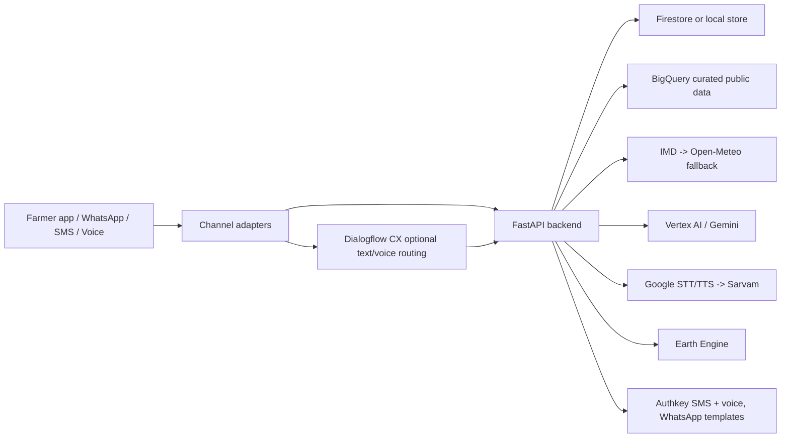

# Kisan Alert

Track 4: Smart Water, Crop and Advisory System.

Kisan Alert is a FastAPI + React Native prototype for small and marginal farmers. It supports multilingual farmer conversations through the app, WhatsApp-style channels, SMS and voice-call flows, with Google Cloud AI, Earth Engine, BigQuery public data and provider fallbacks.

## Demo Flow

1. Farmer opens the React Native app or contacts through WhatsApp/SMS/voice.
2. Farmer is identified by phone number across channels.
3. Language is selected or detected from the farmer message.
4. Farmer can send text, voice note, crop photo or farm location.
5. Backend stores farmer context and conversation history.
6. Advisory uses weather, crop stage, crop history, rainfall, dry-spell/heavy-rain history, soil, groundwater and satellite signals when available.
7. Crop photo/voice logs can create expert follow-up tickets.
8. Response is returned as text and, when TTS provider is configured, voice audio in the farmer language.

## What Is Implemented

- FastAPI backend with local and Firestore stores.
- Expo React Native WhatsApp-style frontend for Android and web.
- Text, image, location and voice-note intake.
- App endpoint: `POST /api/v1/chat/message`.
- WhatsApp/SMS/voice provider adapters for Authkey/generic and Twilio-style webhooks.
- Dialogflow CX fulfillment endpoint and optional text routing.
- Gemini and Vertex AI advisory/vision provider adapters.
- Google STT/TTS with Sarvam fallback.
- Google Translate with Sarvam fallback.
- IMD weather primary route with Open-Meteo fallback.
- Earth Engine NDVI, NDWI, NDMI, EVI and NDRE adapter.
- BigQuery public-data ingestion and context lookup.
- Admin UI at `/admin` for provider health and provider switching.
- Daily alert runner and Pub/Sub/Scheduler-compatible endpoint.

## Architecture



## Provider Fallbacks

| Feature | Primary | Fallback |
|---|---|---|
| Weather | IMD/government route | Open-Meteo |
| STT | Google Speech-to-Text | Sarvam |
| TTS | Google Text-to-Speech | Sarvam |
| Translation | Google Translate | Sarvam |
| Advisory LLM | Vertex AI | Gemini API |
| Vision/OCR | Vertex AI Vision | Gemini Vision |
| Satellite | Earth Engine | none |
| Maps/geocoding | Google Maps | OSM Nominatim |
| SMS/voice outbound | Authkey | Twilio adapter |
| WhatsApp-style channel | Authkey/generic webhook | Twilio webhook |

If IMD is not configured or its request fails, the weather service attempts Open-Meteo automatically through the provider route.

## Public Data Loaded

BigQuery dataset: `kisan_ai_curated`.

| Table | Rows loaded | Source |
|---|---:|---|
| `subdivision_rainfall_history` | 50,256 | IMD subdivision rainfall CSV / data.gov resource `d0419b03-b41b-4226-b48b-0bc92bf139f8` |
| `maharashtra_dryspell_events` | 6,747 | Maharain tehsil dry-spell report, 2021-2025 |
| `maharashtra_heavy_rainfall_events` | 6,023 | Maharain tehsil heavy-rainfall report, 2021-2025 |
| `crop_production_history` | 5,378 | All-India crop-wise/year-wise APY CSVs, Maharashtra rice estimate CSV, DES district XLSX visible Maharashtra row |

Raw source copies are kept in `data/raw/uploads/`. Generated normalized files are in `data/normalized/`.

Additional normalized files prepared after the verified BigQuery load:

- `data/normalized/crop_production_history/all_states_rice_estimate.csv`: 473 rows from the all-state rice estimate file.
- `data/normalized/crop_production_history/des_district_2024_25_all_visible_rows.csv`: 29 visible DES workbook rows.
- `data/normalized/aspirational_districts/aspirational_districts.csv`: 112 aspirational district rows.

Load these with the commands in the data-loading section after applying the latest schema.

Current verified Maharashtra context for `Ahilyanagar / Rice / Kharif / July`:

- Rainfall normal: available through `Madhya Maharashtra` IMD subdivision fallback.
- Crop history: latest loaded rice yield available.
- Dry-spell history: available.
- Heavy-rainfall history: available.
- Still missing for better precision: groundwater, soil-health baseline and agromet advisory rows.

## Data Refresh And Cache Policy

Regional data can be reused for farmers in the same area. Cache key uses source type, provider, state, district, taluka and optional rounded lat/lon.

| Source | Refresh |
|---|---|
| Weather forecast | 3 hours |
| IMD warning | 1 hour |
| Agromet advisory | 24 hours |
| Earth Engine satellite index | 7 days |
| Maharain dry/heavy rainfall | 7 days |
| Groundwater | 30 days |
| Soil health baseline | 90 days |
| Crop history | 365 days |

## Required Environment

Only `.env.example` is tracked. Real `.env`, `Details.txt`, service-account JSON and `local-secrets/` are ignored and must be shared separately.

Minimum local/offline run:

```env
DATA_STORE_PROVIDER=local
ENABLE_GOOGLE_INTEGRATIONS=false
OPEN_METEO_BASE_URL=https://api.open-meteo.com/v1/forecast
```

Live/demo variables:

```env
GOOGLE_CLOUD_PROJECT=kisanai-501120
GOOGLE_CLOUD_LOCATION=global
GCP_REGION=asia-south1
DATA_STORE_PROVIDER=firestore
FIRESTORE_DATABASE=(default)
BIGQUERY_PUBLIC_DATASET=kisan_ai_curated
GEMINI_API_KEY=
GEMINI_MODEL=gemini-2.5-flash
VERTEX_AI_MODEL=gemini-2.5-flash
SARVAM_API_KEY=
MAPS_API_KEY=
STORAGE_BUCKET=
PUBSUB_ALERT_TOPIC=kisan-alerts
DIALOGFLOW_ROUTING_ENABLED=false
DIALOGFLOW_AGENT_ID=
DIALOGFLOW_LOCATION=global
AUTHKEY_API_KEY=
AUTHKEY_SMS_SENDER=
AUTHKEY_WHATSAPP_TEMPLATE_ID=
AUTHKEY_WHATSAPP_MEDIA_TEMPLATE_ID=
AUTHKEY_SEND_ENABLED=false
IMD_API_BASE_URL=
IMD_API_KEY=
OPEN_METEO_BASE_URL=https://api.open-meteo.com/v1/forecast
```

## Local Setup

Backend:

```bash
python3 -m venv .venv
source .venv/bin/activate
pip install -r requirements.txt
pip install -e ".[dev]"
DATA_STORE_PROVIDER=local ENABLE_GOOGLE_INTEGRATIONS=false uvicorn app.main:app --host 127.0.0.1 --port 8080
```

Frontend:

```bash
cd react_native_chat_app
npm install
npm run typecheck
EXPO_PUBLIC_API_URL=http://127.0.0.1:8080 npm run web -- --port 8081
```

Android emulator:

```bash
cd react_native_chat_app
npm run android
```

The Android emulator uses `http://10.0.2.2:8080` by default. For a physical device, run:

```bash
EXPO_PUBLIC_API_URL=http://YOUR_MACHINE_LAN_IP:8080 npm start
```

## Tests

```bash
DATA_STORE_PROVIDER=local ENABLE_GOOGLE_INTEGRATIONS=false .venv-google/bin/python -m pytest tests
.venv-google/bin/python -m compileall app scripts smoke_tests tests
cd react_native_chat_app && npm run typecheck
```

Latest verified result:

```text
49 passed, 1 warning
React Native typecheck passed
```

Real-provider smoke tests are in `smoke_tests/`. They require `.env` keys and Google ADC:

```bash
gcloud auth application-default login
.venv-google/bin/python smoke_tests/test_gemini.py
.venv-google/bin/python smoke_tests/test_firestore.py
.venv-google/bin/python smoke_tests/test_bigquery_public_context.py
.venv-google/bin/python smoke_tests/test_open_meteo.py
.venv-google/bin/python smoke_tests/test_authkey_channels.py
```

## Data Loading

Apply schema:

```bash
bq query --use_legacy_sql=false < infra/bigquery/public_data_schema.sql
```

Normalize source files:

```bash
.venv-google/bin/python scripts/fetch_public_data_sources.py normalize-imd-subdivision \
  data/raw/uploads/Sub_Division_IMD_2017.csv \
  --out data/normalized/subdivision_rainfall_history/imd_subdivision_2017.csv

.venv-google/bin/python scripts/fetch_public_data_sources.py fetch-maharain \
  --start-year 2021 \
  --end-year 2025 \
  --out-dir data/raw/maharain \
  --normalized-dir data/normalized \
  --insecure

.venv-google/bin/python scripts/fetch_public_data_sources.py normalize-crop-csv \
  "data/raw/uploads/Final-Estimate-of-Area,-Production-&-Yield-for-Rice.csv" \
  --state-filter Maharashtra \
  --out data/normalized/crop_production_history/maharashtra_rice_estimate.csv

.venv-google/bin/python scripts/fetch_public_data_sources.py normalize-crop-csv \
  "data/raw/uploads/All-India_-Crop-wise-Area,-Production-&-Yield.csv" \
  --out data/normalized/crop_production_history/all_india_crop_wise.csv

.venv-google/bin/python scripts/fetch_public_data_sources.py normalize-crop-csv \
  "data/raw/uploads/All-India_-Year-wise-Crop-Area,-Production-&-Yield.csv" \
  --out data/normalized/crop_production_history/all_india_year_wise.csv

.venv-google/bin/python scripts/fetch_public_data_sources.py normalize-des-district-xlsx \
  "data/raw/uploads/DES-District-Data-For-2024-25.xlsx" \
  --state-filter Maharashtra \
  --out data/normalized/crop_production_history/maharashtra_des_district_2024_25.csv

.venv-google/bin/python scripts/fetch_public_data_sources.py normalize-crop-csv \
  "data/raw/uploads/Final-Estimate-of-Area,-Production-&-Yield-for-Rice.csv" \
  --out data/normalized/crop_production_history/all_states_rice_estimate.csv

.venv-google/bin/python scripts/fetch_public_data_sources.py normalize-des-district-xlsx \
  "data/raw/uploads/DES-District-Data-For-2024-25.xlsx" \
  --out data/normalized/crop_production_history/des_district_2024_25_all_visible_rows.csv

.venv-google/bin/python scripts/fetch_public_data_sources.py normalize-aspirational-districts \
  "data/raw/uploads/Aspirational District.csv" \
  --out data/normalized/aspirational_districts/aspirational_districts.csv
```

Load normalized data:

```bash
.venv-google/bin/python scripts/ingest_public_data.py subdivision_rainfall_history \
  data/normalized/subdivision_rainfall_history/imd_subdivision_2017.csv \
  --source-name "IMD subdivision rainfall CSV" \
  --source-url "https://api.data.gov.in/resource/d0419b03-b41b-4226-b48b-0bc92bf139f8"

.venv-google/bin/python scripts/ingest_public_data.py maharashtra_dryspell_events \
  data/normalized/maharashtra_dryspell_events/maharain_dryspell.csv \
  --source-name "Maharain tehsil dry spell" \
  --source-url "https://maharain.maharashtra.gov.in/test/maharain/rpt_past_queries_tehsil_wise_dryspell.php"

.venv-google/bin/python scripts/ingest_public_data.py maharashtra_heavy_rainfall_events \
  data/normalized/maharashtra_heavy_rainfall_events/maharain_heavy_rainfall.csv \
  --source-name "Maharain tehsil heavy rainfall" \
  --source-url "https://maharain.maharashtra.gov.in/test/maharain/rpt_past_queries_tehsil_wise_heavy_rainfall.php"

.venv-google/bin/python scripts/ingest_public_data.py crop_production_history \
  data/normalized/crop_production_history/maharashtra_rice_estimate.csv \
  --source-name "DES final rice estimate"

.venv-google/bin/python scripts/ingest_public_data.py crop_production_history \
  data/normalized/crop_production_history/all_states_rice_estimate.csv \
  --source-name "All-state rice final estimate"

.venv-google/bin/python scripts/ingest_public_data.py crop_production_history \
  data/normalized/crop_production_history/des_district_2024_25_all_visible_rows.csv \
  --source-name "DES district 2024-25 visible rows"

.venv-google/bin/python scripts/ingest_public_data.py aspirational_districts \
  data/normalized/aspirational_districts/aspirational_districts.csv \
  --source-name "Aspirational Districts"
```

Data still useful to add later:

- Groundwater depth/status by district/block from India-WRIS or CGWB.
- Soil-health district/block baseline from Soil Health Card or state soil data.
- IMD agromet advisory rows by district/crop.
- More district-level Maharashtra crop APY rows for crops beyond the current rice/DES sample.

## Manual API Checks

```bash
curl -X POST http://127.0.0.1:8080/api/v1/chat/message \
  -H "Content-Type: application/json" \
  -d '{"from_phone":"+91 9970983794","text":"माझ्या शेताला आज पाणी द्यावे का?","language":"mr-IN"}'

curl -X POST http://127.0.0.1:8080/api/v1/chat/message \
  -H "Content-Type: application/json" \
  -d '{"from_phone":"+91 9970983794","latitude":19.0948,"longitude":74.7480,"location_label":"Ahilyanagar farm","language":"mr-IN"}'
```

Useful endpoints:

| Endpoint | Purpose |
|---|---|
| `GET /health` | Boolean service health. |
| `GET /admin` | Provider route/admin UI. |
| `POST /api/v1/chat/message` | App text/image/audio/location chat. |
| `POST /api/v1/weather/context` | IMD/Open-Meteo weather context. |
| `POST /api/v1/data/context` | BigQuery public-data context. |
| `POST /api/v1/recommendations/crop` | Crop recommendation. |
| `POST /api/v1/advisories/dry-spell` | Dry-spell advisory. |
| `POST /api/v1/diagnosis/log` | Crop diagnosis and expert ticket. |
| `POST /api/v1/alerts/run-daily` | Alert runner. |
| `POST /api/v1/dialogflow/webhook` | Dialogflow CX fulfillment. |
| `POST /api/v1/whatsapp/webhook` | Authkey/generic WhatsApp webhook. |
| `POST /api/v1/sms/webhook` | Authkey/generic SMS webhook. |
| `POST /api/v1/calls/webhook` | Authkey/generic voice callback. |
| `POST /api/v1/twilio/whatsapp` | Twilio WhatsApp webhook. |
| `POST /api/v1/twilio/sms` | Twilio SMS webhook. |
| `POST /api/v1/twilio/voice` | Twilio voice webhook. |

## Deployment

Create secrets in Secret Manager for each real key, then deploy:

```bash
PROJECT_ID=kisanai-501120 \
REGION=asia-south1 \
SERVICE_NAME=kisan-alert-api \
GEMINI_API_KEY_SECRET=GEMINI_API_KEY \
SARVAM_API_KEY_SECRET=SARVAM_API_KEY \
AUTHKEY_API_KEY_SECRET=AUTHKEY_API_KEY \
MAPS_API_KEY_SECRET=MAPS_API_KEY \
scripts/deploy_cloud_run.sh
```

Set up daily alerts:

```bash
PROJECT_ID=kisanai-501120 REGION=asia-south1 SERVICE_NAME=kisan-alert-api scripts/setup_scheduler_pubsub.sh
```

Print webhook URLs:

```bash
PROJECT_ID=kisanai-501120 REGION=asia-south1 SERVICE_NAME=kisan-alert-api scripts/print_webhook_urls.sh
```

Configure after deployment:

- Dialogflow CX fulfillment: `https://SERVICE_URL/api/v1/dialogflow/webhook`
- Twilio WhatsApp: `https://SERVICE_URL/api/v1/twilio/whatsapp`
- Twilio SMS: `https://SERVICE_URL/api/v1/twilio/sms`
- Twilio Voice: `https://SERVICE_URL/api/v1/twilio/voice`
- Authkey/generic WhatsApp: `https://SERVICE_URL/api/v1/whatsapp/webhook`
- Authkey/generic SMS: `https://SERVICE_URL/api/v1/sms/webhook`
- Authkey/generic voice callback: `https://SERVICE_URL/api/v1/calls/webhook`

Frontend web export:

```bash
cd react_native_chat_app
EXPO_PUBLIC_API_URL=https://SERVICE_URL npm run export:web
```

Deploy `react_native_chat_app/dist/` to Firebase Hosting, Cloud Storage static hosting, Netlify, Vercel or any static host. For Android build, set `EXPO_PUBLIC_API_URL=https://SERVICE_URL` before building.

## Known Limits

- WhatsApp outbound audio needs a provider-supported public media URL/template. The backend returns audio in app/API responses now; WhatsApp provider delivery still depends on template/session capability.
- `api.data.gov.in` IMD resource timed out locally, so the loaded IMD subdivision data currently comes from the downloaded CSV copy.
- Maharain fetch uses `--insecure` because its certificate chain failed local Python CA verification.
- Groundwater, soil-health baseline and agromet advisory rows should be loaded next for stronger recommendation precision.
- `.venv`, `.venv-*`, `.env`, `Details.txt`, `local-secrets/`, `node_modules/`, `.expo/` and build outputs are ignored. Only `.env.example` should be committed.

## IP Boundary

This is a clean hackathon project for the competition problem statement. It does not depend on private product code or proprietary app assets.
