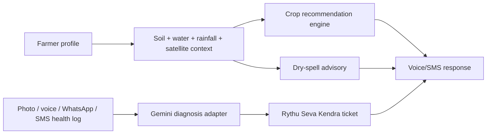

# Architecture Notes

Kisan Alert is intentionally structured as a modular backend first. The hackathon demo can run from API docs, and teammates can add mobile/web/chat channels without changing the core business logic.

This repository is competition-scoped. It should not receive private product code, assets, production credentials, private schemas, or existing app-specific logic from other projects.

## Core Use Case

## Boundaries

- API layer: `app/api/v1/endpoints`
  - Owns request validation and HTTP behavior only.
- Models: `app/models`
  - Shared contracts for API, services, and tests.
- Repositories: `app/repositories`
  - Current implementation is in-memory for a fast demo.
  - Replace with Firestore, Cloud SQL, or BigQuery-backed persistence later.
- Services: `app/services`
  - Crop recommendation, advisory, diagnosis and channel logic.
  - External Google Cloud integrations should stay behind these classes.
  - `GovernmentDataService`, `CropStageAdvisoryService`, `SoilCardVisionService`,
    `ConversationStore` and `AlertPriorityPolicy` are the main extension points.

## Google Cloud Ownership

- Gemini / Vertex AI: `GeminiService`
  - Input: crop, symptom text, voice transcript, optional photo URI.
  - Output must remain `DiagnosisResult`.
- Earth Engine: `EarthEngineService`
  - Replace demo NDVI with satellite NDVI/time-series by farm polygon.
- Speech-to-Text and Text-to-Speech: `VoiceService`
  - Replace transcript/audio placeholders with Cloud Speech APIs.
- WhatsApp Business: `WhatsAppService`
  - Add webhook verification, message templates, media download and delivery receipts.
- Voice-call IVR: `CallService`
  - Add provider callback verification, DTMF menus, speech transcript handoff and expert transfer.
- Translation API: `app/utils/language.py`
  - Current demo has phrase-level translations.
  - Production can translate generated advisories and cache by language.
- Cloud Run: Dockerfile is ready for a container deployment.
- BigQuery: best fit for public rainfall, soil, groundwater and usage analytics.
- Alert priority: `AlertPriorityPolicy`
  - Low: WhatsApp/feed.
  - Medium: WhatsApp or SMS.
  - High: WhatsApp + SMS.
  - Critical: WhatsApp + SMS + voice call.

## Suggested Team Split

- Backend/API: extend endpoints and persistence repository.
- AI/ML: Gemini diagnosis and crop recommendation scoring improvements.
- Geo/weather: Earth Engine NDVI, weather forecast and dry-spell model.
- Voice/SMS: speech APIs, SMS gateway, Dialogflow or WhatsApp flow.
- WhatsApp/calls: provider webhook setup, templates, IVR menu and media intake.
- Frontend/demo: simple farmer intake and dashboard UI against these APIs.

## Data Standard

Store farmer-facing text in the farmer language, but keep analytics fields canonical:

- Crop identity: English key such as `maize`, `chilli`, `paddy`.
- Location: store raw user value and normalized state/district when available.
- Advisory: store generated user-language response plus canonical intent.
- Tickets: store canonical issue/severity so expert dashboards remain searchable.
