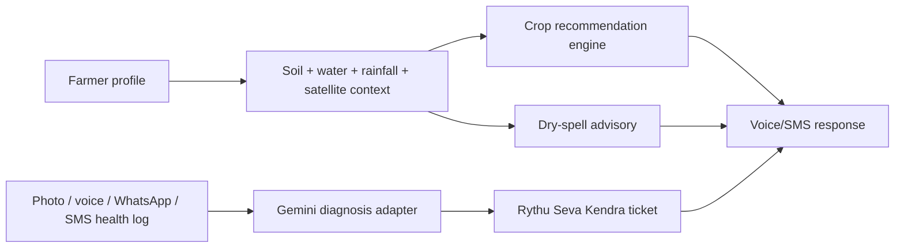

# Architecture Notes

Kisan Alert is intentionally structured as a modular backend first. Teammates can add mobile/web/chat channels without changing the core business logic.

This repository is competition-scoped. It should not receive private product code, assets, production credentials, private schemas, or existing app-specific logic from other projects.

## Core Use Case

## Boundaries

- API layer: `app/api/v1/endpoints`
  - Owns request validation and HTTP behavior only.
- Models: `app/models`
  - Shared contracts for API, services, and tests.
- Repositories: `app/repositories`
  - Runtime storage uses Firestore by default.
  - Tests use an isolated local store so they do not mutate cloud data.
- Services: `app/services`
  - Crop recommendation, advisory, diagnosis and channel logic.
  - External Google Cloud integrations should stay behind these classes.
  - `GovernmentDataService`, `CropStageAdvisoryService`, `SoilCardVisionService`,
    `ConversationStore` and `AlertPriorityPolicy` are the main extension points.

## Google Cloud Ownership

- Gemini / Vertex AI: `GeminiService`
  - Input: crop, symptom text, voice transcript, optional photo URI.
  - Output must remain `DiagnosisResult`.
- Earth Engine: `EarthEngineService`
  - Fetch satellite NDVI/time-series by farm point or polygon.
- Speech-to-Text and Text-to-Speech: `VoiceService`
  - Use Cloud Speech APIs first, with Sarvam as configured fallback.
  - Store transcript, response text, language, intent and source metadata durably.
  - Store raw voice/audio media only when needed for diagnosis/audit, with explicit retention rules.
- WhatsApp Business: `WhatsAppService`
  - Add webhook verification, message templates, media download and delivery receipts.
- Voice-call IVR: `CallService`
  - Add provider callback verification, DTMF menus, speech transcript handoff and expert transfer.
- Translation API: `app/utils/language.py`
  - Translate generated advisories and cache by language.
- Cloud Run: Dockerfile is ready for a container deployment.
- BigQuery: best fit for public rainfall, soil, groundwater and usage analytics.
- Alert priority: `AlertPriorityPolicy`
  - Low: WhatsApp/feed.
  - Medium: WhatsApp or SMS.
  - High: WhatsApp + SMS.
  - Critical: WhatsApp + SMS + voice call.

## Suggested Team Split

- Backend/API: extend endpoints and persistence repository.
- AI/ML: Gemini diagnosis and crop recommendation scoring improvements.
- Geo/weather: Earth Engine NDVI, weather forecast and dry-spell model.
- Voice/SMS: speech APIs, SMS gateway, Dialogflow or WhatsApp flow.
- WhatsApp/calls: provider webhook setup, templates, IVR menu and media intake.
- Frontend/admin: provider controls, farmer chat intake, dashboard UI against these APIs.

## Data Standard

Store farmer-facing text in the farmer language, but keep analytics fields canonical:

- Crop identity: English key such as `maize`, `chilli`, `paddy`.
- Location: store raw user value and normalized state/district when available.
- Advisory: store generated user-language response plus canonical intent.
- Tickets: store canonical issue/severity so expert dashboards remain searchable.

## Farmer Experience

Do not force a long onboarding form. The farmer can start from WhatsApp, SMS, call, or app:

1. Normalize phone number and reuse the same farmer profile across channels.
2. Detect language from text/voice when possible; ask only if unknown.
3. Capture location from WhatsApp shared location, GPS, pincode, or spoken village/pincode.
4. Ask for crop, soil, sowing date, and farm coordinates only when the current question needs them.
5. Store each answer once and reuse it for future advisories.

Durable farmer memory is text-first. Audio is not the primary record because transcripts and normalized metadata are cheaper, searchable, and easier to use in AI context.
